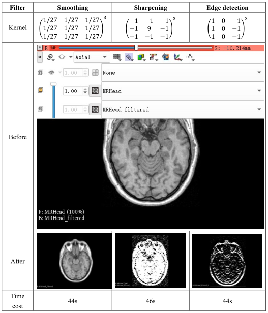
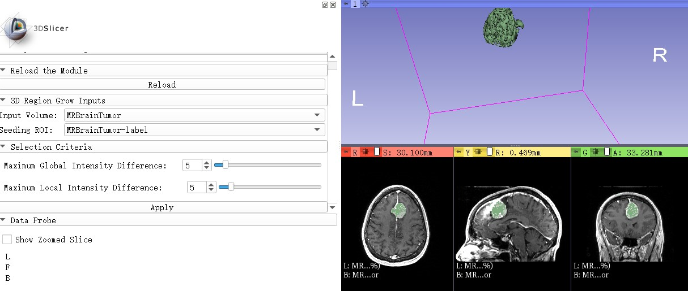
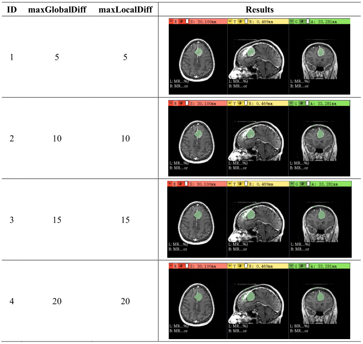

# MIC
Medical Image Computing Module Development

## Medical Image Enhancement (MIE) ##

The source code of MIE is in _MedicalImageEnhancement.py_.

_Table 1_ compares the three filters, including smoothing, sharpening, edge detection in the aspects of the kernel, experiment demo, and time cost of running. The way of achieving a filter is to use the filter to perform convolution operations on 3D images.

    <b>Table 1: Comparison of different filters</b> 
    

## Medical Image Segmentation (MIS) ##

The source code of MIS is in _MedicalImageSegmentation.py_.

_Figure 1_ shows the demonstration of 3D segmentation results achieved using three multiple viewing angles.

    <b>Figure 1: 3D segmentation result of the tumor</b> 
    

_Table 2_ shows the demonstration of the experiments on different global and local parameter combinations. 

    <b>Table 2: Part experiments on different global and local parameters</b> 
    

Based on experiment results, the best global and local parameters are among experiments with ID from 2 to 3 considering whether the classification is true or false, positive or negative. The best way to find them is to define an indicator of the best result, then define a distance between the result indicator in current parameters and the best outcome, and finally search for the settings of minimum distance by deep learning. In that way, we do not need to search for the best parameters manually. 
